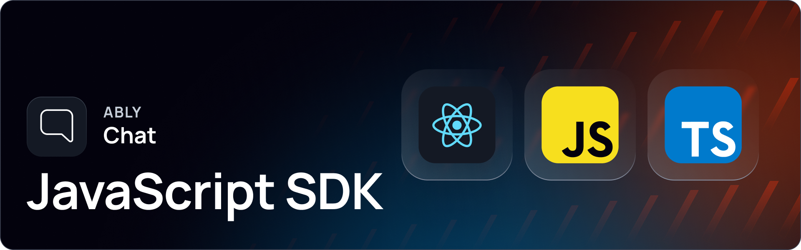

[](https://www.npmjs.com/package/@ably/chat)
[](https://github.com/ably/ably-chat-js/blob/main/LICENSE)


# Ably Chat JavaScript, TypeScript and React SDK

Ably Chat is a set of purpose-built APIs for a host of chat features enabling you to create 1:1, 1:Many, Many:1 and Many:Many chat rooms for any scale. It is designed to meet a wide range of chat use cases, such as livestreams, in-game communication, customer support, or social interactions in SaaS products. Built on [Ably's](https://ably.com/) core service, it abstracts complex details to enable efficient chat architectures.

---

## Getting started

Everything you need to get started with Ably:

* [About Ably Chat.](https://ably.com/docs/chat)
* [Getting started with Ably Chat in JavaScript.](https://ably.com/docs/chat/getting-started/javascript)
* [Getting started with Ably Chat in React.](https://ably.com/docs/chat/getting-started/react)
* [SDK and usage docs in JavaScript.](https://ably.com/docs/chat/setup?lang=javascript)
* [API documentation (Javascript).](https://sdk.ably.com/builds/ably/ably-chat-js/main/typedoc/modules/chat-js.html)
* [API documentation (React Hooks).](https://sdk.ably.com/builds/ably/ably-chat-js/main/typedoc/modules/chat-react.html)
* [Chat Example App.](https://github.com/ably/ably-chat-js/tree/main/demo)
* Play with the [livestream chat demo.](https://ably-livestream-chat-demo.vercel.app/)

---

## Supported platforms

Ably aims to support a wide range of platforms. If you experience any compatibility issues, open an issue in the repository or contact [Ably support](https://ably.com/support).

This SDK supports the following platforms:

| Platform     | Support |
|--------------|---------|
| Browsers     | All major desktop and mobile browsers, including Chrome, Firefox, Edge, Safari (iOS/macOS), Opera, and Android. Internet Explorer is not supported. |
| Node.js      | Version 20 or newer. |
| TypeScript   | Fully supported, the library is written in TypeScript. |
| React        | Includes providers and hooks for deep integration with the React ecosystem. |
| React Native | All React Native platforms. Issues can be reported or support requested. |
| Android      | Supported via the [Ably Chat Kotlin SDK.](https://github.com/ably/ably-chat-kotlin) |
| iOS          | Supported via the [Ably Chat Swift SDK.](https://github.com/ably/ably-chat-swift) |

> [!NOTE]
> The Chat SDK can be installed either from NPM, or included directly from Ably's CDN. Note that you also need to install the core Ably SDK.

---

## Usage

### JavaScript / TypeScript

The following code connects to Ably's chat service, subscribes to a chat room, and sends a message to that room:

```typescript
import * as Ably from 'ably';
import { ChatClient, RoomStatus } from '@ably/chat';

// Initialize Ably Realtime client
const realtimeClient = new Ably.Realtime({
  key: '<your-ably-api-key>',
  clientId: 'your-client-id',
});

// Create a chat client
const chatClient = new ChatClient(realtimeClient);

// Get a chat room
const room = await chatClient.rooms.get('my-room');

// Monitor room status
room.onStatusChange((statusChange) => {
  switch (statusChange.current) {
    case RoomStatus.Attached:
      console.log('Room is attached');
      break;
    case RoomStatus.Detached:
      console.log('Room is detached');
      break;
    case RoomStatus.Failed:
      console.log('Room failed:', statusChange.error);
      break;
    default:
      console.log('Room status:', statusChange.current);
  }
});

// Attach to the room
await room.attach();

// Subscribe to messages
const subscription = room.messages.subscribe((event) => {
  console.log('Received message:', event.message.text);
});

// Send a message
await room.messages.send({ text: 'Hello, World!' });
```

### React

For React applications, the SDK provides hooks and providers for seamless integration:

```tsx
import * as Ably from 'ably';
import { ChatClient } from '@ably/chat';
import { ChatClientProvider, ChatRoomProvider, useMessages } from '@ably/chat/react';
import { AblyProvider } from 'ably/react';

// Initialize clients
const realtimeClient = new Ably.Realtime({
  key: '<your-ably-api-key>',
  clientId: 'your-client-id',
});
const chatClient = new ChatClient(realtimeClient);

// Wrap your app with providers
function App() {
  return (
    <AblyProvider client={realtimeClient}>
      <ChatClientProvider client={chatClient}>
        <ChatRoomProvider name="my-room">
          <ChatComponent />
        </ChatRoomProvider>
      </ChatClientProvider>
    </AblyProvider>
  );
}

// Use hooks to interact with chat
function ChatComponent() {
  const { sendMessage } = useMessages({
    listener: (event) => {
      console.log('Received message:', event.message.text);
    },
  });

  const handleSend = () => {
    sendMessage({ text: 'Hello, World!' });
  };

  return <button onClick={handleSend}>Send Message</button>;
}
```

---

## Releases

The [CHANGELOG.md](/ably/ably-chat-js/blob/main/CHANGELOG.md) contains details of the latest releases for this SDK. You can also view all Ably releases on [changelog.ably.com](https://changelog.ably.com).

---

## Contribute

Read the [CONTRIBUTING.md](./CONTRIBUTING.md) guidelines to contribute to Ably or [Share feedback or request](https://forms.gle/mBw9M53NYuCBLFpMA) a new feature.

---

## Support, feedback, and troubleshooting

For help or technical support, visit Ably's [support page](https://ably.com/support). You can also view the [community reported Github issues](https://github.com/ably/ably-chat-js/issues) or raise one yourself.
